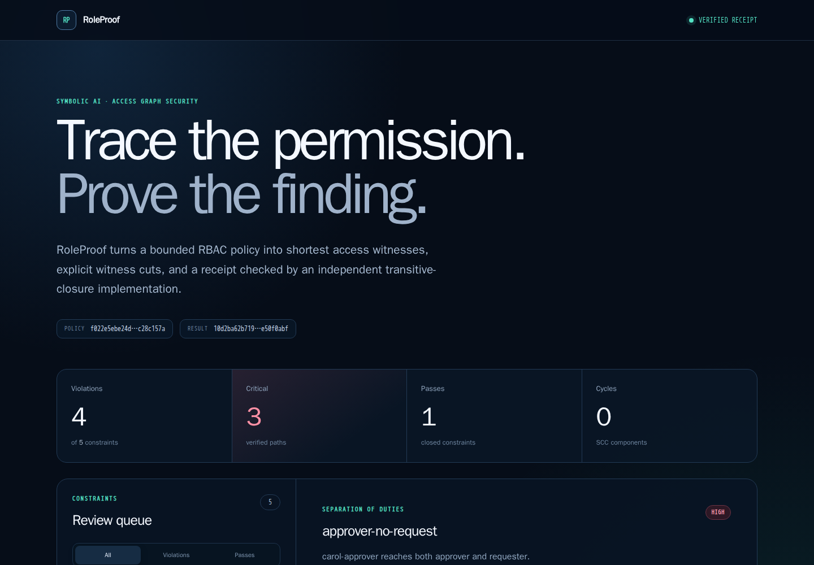
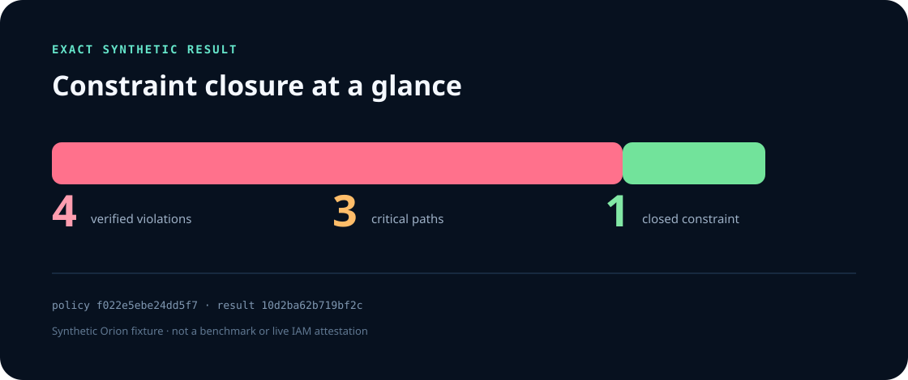
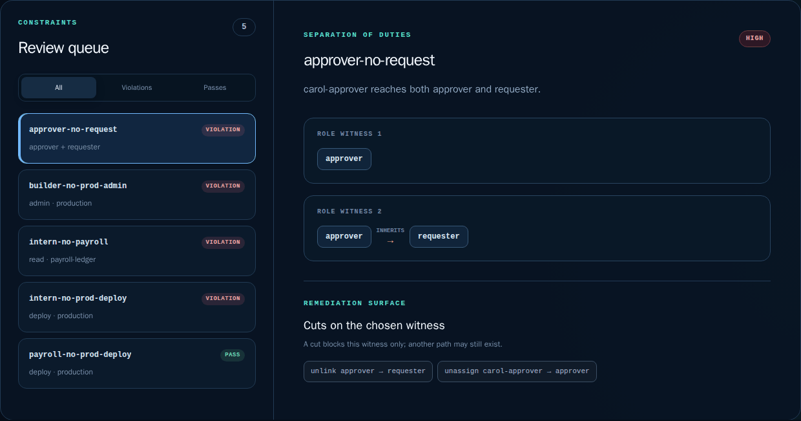
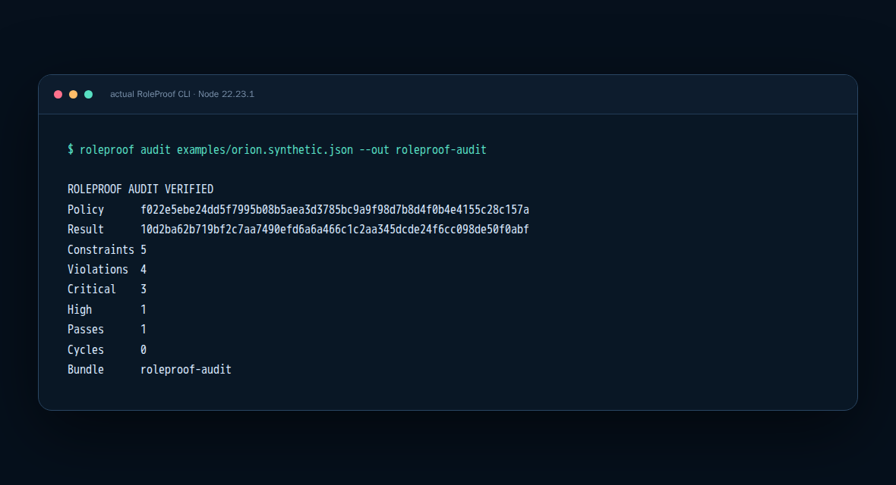
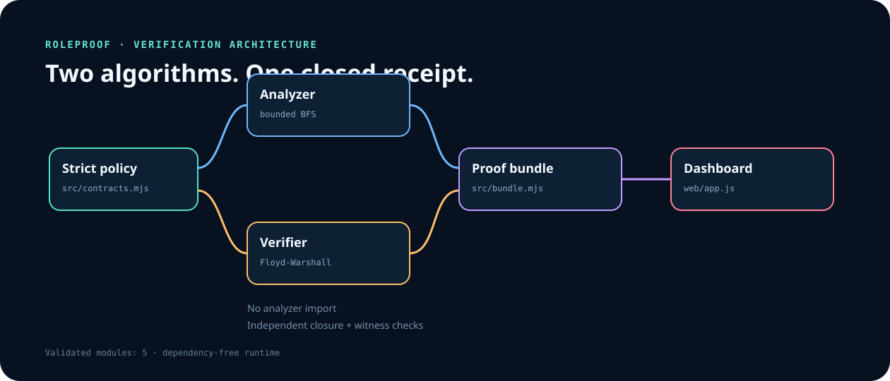
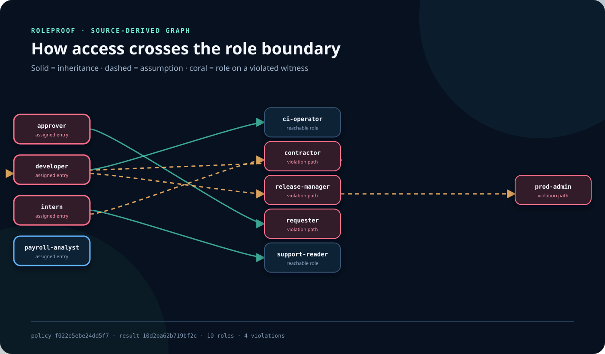
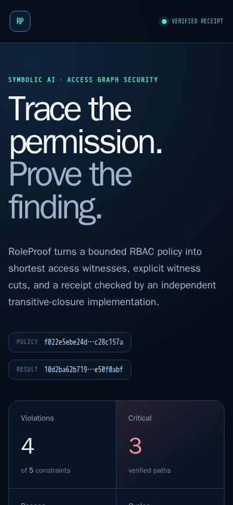

# RoleProof

**Explainable symbolic access-policy analysis with independently verified
escalation witnesses.** RoleProof accepts a bounded RBAC graph, finds the
shortest paths that violate explicit constraints, proposes cuts on each chosen
witness, and closes the result with a second algorithm that never imports the
analyzer.

<p align="center">
  
</p>
<p align="center"><sub>Real 1440 × 1000 Chromium capture generated from the committed synthetic policy and receipt.</sub></p>

RoleProof is deliberately small enough to audit: the Node.js runtime has
**zero third-party dependencies**, the policy contract is capped at 64 KiB and
64 roles, and every committed screenshot can be regenerated from source in a
network-isolated pinned browser container.

## Why this project exists

Access reviews often stop at “this principal is an admin.” RoleProof preserves
the explanation:

- which assigned role started the path;
- which steps were inheritance versus role assumption;
- which grant reached the action and resource;
- why the path violates a declared deny-access or separation-of-duties rule;
- which edge, grant, or assignment would cut that particular witness; and
- whether an independent closure implementation can reproduce the finding.

The output is a review artifact, not an authorization decision. It makes a
bounded model inspectable and tamper-evident.

## Exact synthetic result



| Orion fixture | Exact result |
|---|---:|
| Principals | 4 |
| Roles | 10 |
| Resources | 4 |
| Constraints | 5 |
| Verified violations | 4 |
| Critical / high | 3 / 1 |
| Passes | 1 |
| Cycle components | 0 |

These are correctness-fixture results, not benchmark numbers or claims about a
live identity provider. The full
[analysis receipt](docs/evidence/roleproof-analysis.json) and
[independent verification](docs/evidence/roleproof-verification.json) are
committed for inspection.

## Interactive workflow



1. Load a `roleproof.policy.v1` document through the strict decoder.
2. Normalize set-like fields and bind the policy with SHA-256.
3. Find deterministic shortest-then-lexicographic access witnesses.
4. Report strongly connected role components with Tarjan's algorithm.
5. Derive cuts scoped explicitly to the chosen witness.
6. Recompute reachability independently with Floyd–Warshall.
7. Validate finding completeness, every edge and grant, shortest lengths, cuts,
   and receipt hashes.
8. Write a no-clobber audit directory or explore the same closed receipt in the
   local dashboard.

## Run it

Requirements: Node.js 22 or 24. CI pins both supported lines exactly.

```bash
git clone https://github.com/omar07ibrahim/roleproof.git
cd roleproof
npm ci --ignore-scripts
npm test
npm run build
node src/cli.mjs serve --port 4173
```

The dashboard is then available only on `http://127.0.0.1:4173`. The server
uses an exact asset inventory, validates the `Host` header, rejects unexpected
methods and path forms, and sends a restrictive CSP.

Create and verify a portable audit bundle:

```bash
node src/cli.mjs audit examples/orion.synthetic.json --out roleproof-audit
node src/cli.mjs verify \
  examples/orion.synthetic.json \
  roleproof-audit/analysis.receipt.json
```

Audit directories are all-or-nothing and no-clobber: choose a new output path
instead of silently replacing previous evidence.

<p>
  
</p>

The raw terminal transcript is also available as
[plain text](docs/evidence/roleproof-cli.txt).

### CLI surface

| Command | Purpose |
|---|---|
| `roleproof audit POLICY --out DIRECTORY` | Write normalized policy, receipt, verification, and manifest |
| `roleproof analyze POLICY` | Emit the deterministic analysis receipt as JSON |
| `roleproof verify POLICY RECEIPT` | Independently verify a supplied receipt |
| `roleproof serve [--port PORT]` | Serve the built dashboard on loopback only |

The package also exports the parser, analyzer, bundle writer, limits, formats,
and verifier from `roleproof`. CI builds an npm tarball, installs it outside the
checkout, and exercises both this public API and the installed binary.

## Architecture



| Boundary | Responsibility | Important invariant |
|---|---|---|
| Strict decoder | UTF-8 JSON, schema, IDs, references, bounds | Duplicate keys and unknown fields fail closed |
| Analyzer | Reachability, witnesses, SCCs, witness cuts | Shortest path first; lexical tie-breaks |
| Independent verifier | Reconstructed closure and receipt validation | Does not import the analyzer |
| Bundle writer | Four-file review artifact | New directory, fixed inventory, 0600 files |
| Dashboard | Receipt exploration | Text-only DOM construction; no live IAM calls |
| Loopback server | Local static delivery | Fixed routes, defensive headers, timeouts |

The two algorithms intentionally trade a little implementation duplication for
a stronger review boundary: a bug in analyzer traversal should not be repeated
by the verifier's closure logic. See the
[architecture note](docs/architecture.md) for data flow, invariants, and
complexity.

## Source-derived role graph



Solid arrows represent inheritance; dashed arrows represent role assumption.
Coral roles participate in at least one violated witness. The SVG is generated
from the same normalized policy and receipt as the JSON evidence—there is no
hand-edited graph.

## Real responsive evidence

<table>
  <tr>
    <th width="34%">390 × 844 mobile viewport</th>
    <th width="66%">Verified CLI receipt</th>
  </tr>
  <tr>
    <td></td>
    <td></td>
  </tr>
</table>

Also inspect the
[full-page dashboard capture](docs/evidence/roleproof-full-page.png). Every
visual is produced by `tools/capture_evidence.py` from actual output. The
[evidence manifest](docs/evidence/roleproof-evidence.json) records each file's
bytes and SHA-256, the exact source records, Chromium 151.0.7922.34,
Playwright 1.62.0, Pillow 12.3.0, the container digest, and the explicit claim
boundary.

The permanent evidence workflow regenerates the complete 12-file bundle in a
read-only, network-disabled container and compares every committed byte. The
initial adoption additionally required two independent captures to be
byte-identical. See [evidence methodology](docs/evidence-method.md).

## Security and reliability

- Input is capped by bytes, JSON tokens, nesting depth, collection sizes,
  outgoing edges, grants, and actions.
- File reads reject symlinks and non-regular files and detect changes during
  the read.
- Role cycles are accepted as data, bounded by the finite graph, and reported
  rather than followed recursively.
- Receipt verification rejects omissions, false passes, invalid witnesses,
  incorrect shortest lengths, invalid cuts, and rehashed tampering.
- Output uses a private temporary directory, fixed filenames, restrictive
  modes, atomic publication, and no overwrite.
- The dashboard needs no credentials, network connector, employee data, or
  production policy export.
- Evidence capture runs without network access, capabilities, or a writable
  source tree.

The detailed assumptions and residual risks live in the
[threat model](docs/threat-model.md). Security reports should follow
[SECURITY.md](SECURITY.md).

## Verification matrix

`npm run check` currently executes **25 tests** with Node's built-in test
runner and a dependency audit. GitHub Actions additionally checks:

- Node 22.23.1 and Node 24.16.0;
- deterministic site construction and a clean worktree;
- malformed input and CLI error sanitization;
- rehashed receipt tampering and finding completeness;
- source-derived SVG safety and exact static-site inventory;
- guarded loopback HTTP behavior;
- packed npm contents, installation outside the repository, public API, and
  installed CLI behavior; and
- complete visual evidence regeneration in pinned Chromium.

## Repository map

```text
src/
  contracts.mjs     bounded policy contract and file boundary
  analyze.mjs       deterministic witnesses, SCCs, scoped cuts
  verify.mjs        independent closure and receipt verification
  bundle.mjs        portable no-clobber audit bundles
  server.mjs        guarded loopback static server
web/                dependency-free interactive dashboard
examples/           synthetic Orion policy
docs/evidence/      receipts, screenshots, GIF, diagrams, manifest
test/               contract, analyzer, verifier, CLI, server, SVG, site tests
tools/              site build and reproducible evidence capture
```

## Claim boundary

RoleProof analyzes only the declared bounded graph. It is **not** a live IAM
scanner, policy enforcement point, global-remediation optimizer, compliance
certification, benchmark, or proof that a cloud provider enforces the modeled
state. A reported cut blocks the selected witness only; another path may still
exist. Use synthetic or properly redacted policies in public repositories.

MIT licensed.
